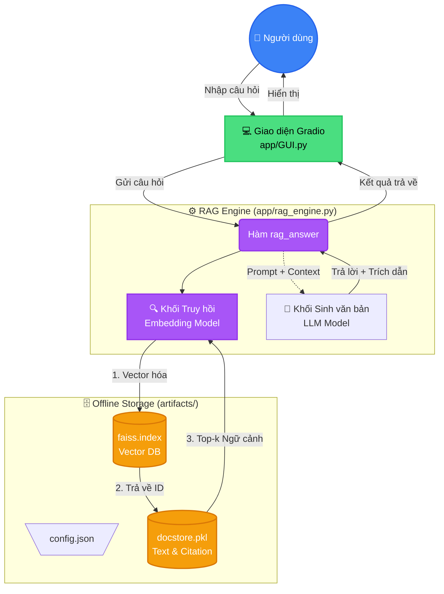

# 🏛️ Kiến Trúc Hệ Thống Chatbot Luật Việt Nam (RAG)

Dự án áp dụng kiến trúc **Retrieval-Augmented Generation (RAG)** để xây dựng chatbot tư vấn luật. Dưới đây là sơ đồ và cấu trúc phân rã chi tiết của hệ thống.

---

## 📊 Sơ Đồ Luồng Hoạt Động (RAG Pipeline)

---

## 📂 Chi Tiết Tách Nhánh Hệ Thống

Kiến trúc được chia làm 3 phân nhánh chính để dễ quản lý:

### 1️⃣ Nhánh Giao Diện (User Interface)
**Vị trí file:** `app/GUI.py`
- Được xây dựng bằng thư viện tạo web **Gradio**.
- **Chức năng chính:**
  - Nhận câu hỏi đầu vào từ người dùng thông qua hộp thoại Textbox.
  - Chuyển tiếp câu hỏi vào hàm xử lý lõi (`rag_answer`).
  - Phân tích và hiển thị kết quả thành 2 phần tách biệt giúp người đọc dễ dùng: **Câu trả lời** và **Nguồn trích dẫn (Citations)**.

### 2️⃣ Nhánh Xử Lý Lõi (RAG Engine)
**Vị trí file:** `app/rag_engine.py`

Đây là trung tâm điều phối và "bộ não" của chatbot, chia làm 2 bước thực thi đồ sộ:

- **Bước 1: Truy vấn (Retriever)**
  - Tải mô hình nhúng Text-to-Vector (`SentenceTransformer`).
  - Biến câu hỏi đầu vào của người dùng thành **Vector**.
  - Phóng Vector đó vào thuật toán tìm kiếm trên kho dữ liệu tĩnh để rà soát danh sách các cụm đoạn luật có ý nghĩa tương đương.
  - *Bộ lọc tĩnh ở code:* Trong source code áp dụng một dòng điều kiện ưu tiên hardcode kết quả có chứa từ khóa `"người lao động"`.

- **Bước 2: Sinh văn bản (Generator)**
  - Khởi tạo mô hình ngôn ngữ lớn LLM (`AutoModelForCausalLM` - ví dụ như Qwen).
  - Kết hợp *Câu hỏi mộc* của người dùng và *Ngữ cảnh luật thu thập top-k được* vào một **Prompt** (lời mớm) kịch bản chặt chẽ.
  - Hệ thống "ra lệnh" cho LLM chỉ được phép trả lời dựa trên ngữ cảnh đã cho, tuyệt đối cấm bịa đặt thông tin (để triệt tiêu chống ảo giác - hallucination).

### 3️⃣ Nhánh Dữ Liệu Tĩnh (Offline Storage)
**Vị trí:** thư mục `artifacts/`

Chứa các dữ liệu bộ luật (dataset) đã được làm sạch và lưu lại thành các tệp nhị phân nén sẵn, giúp hệ thống không cần tính toán tải lại CSV nhiều lần:
- 📄 `config.json`: Cấu hình của app (tên loại model nhúng, tham số `top_k` kết quả cần lấy,...).
- 🗃️ `faiss.index`: Chứa vector không gian nhúng của dữ liệu luật sử dụng qua thư viện FAISS của Meta. Giúp tìm kiếm ngữ nghĩa song song hàng vạn câu luật trong tíc tắc (similarity search).
- 📦 `docstore.pkl`: Tệp định dạng Pickle chứa bộ từ điển văn bản luật thô. Khi bộ FAISS tìm thấy ID Vector phù hợp, `docstore` sẽ trích xuất ID đó thành một đoạn chữ tiếng Việt thực tế và liên kết URL để tạo thành cơ sở tham chiếu (citation).
